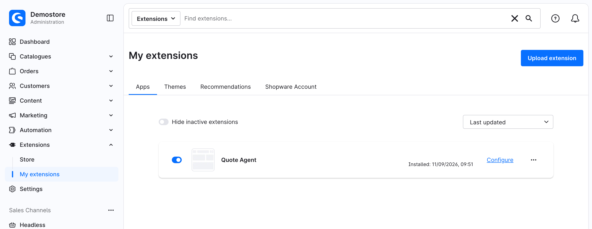

# Merchant Quote Agent

A Shopware 6.7 extension that answers your B2B customers' price requests on
quotes for you. It works only inside the limits you set, and it hands every
other request to a person on your team.

> [!NOTE]
> **Alpha.** This is an early release. Try it on a staging shop or one sales
> channel first, and turn on Draft Mode to approve every reply before a
> customer sees it. **[Download the latest release](https://github.com/agentic-commerce-lab/merchant-quote-agent-plugin/releases/latest)**.

- **It never goes past your cap.** You set the largest discount it may give.
  Ordinary code checks every offer against your limits before it is saved and
  again after. An offer above your limits is thrown away, and a person takes
  over the quote.
- **Anything that isn't about price goes to a person.** That includes shipping,
  payment terms and changes to the products on the quote. The agent tells the
  customer a colleague will follow up and puts the quote in front of you. If a
  request is unclear, it first asks the customer one short question.
- **Every decision is logged.** A dashboard shows what it offered, what it
  escalated and why.
- **It starts switched off.** A fresh install answers nothing until you turn it
  on and set a discount limit.


## What you need

| | |
| --- | --- |
| **Shopware** | 6.7.1 or newer, on PHP 8.3 or newer |
| **B2B quotes** | SwagCommercial 6.7.1.2 or newer, with quote management licensed (`QUOTE_MANAGEMENT-6302947`). The agent works on the quotes this feature creates. |
| **An AI provider** | Your own API key, base URL and model name. Any provider with OpenAI's Chat Completions API and structured outputs works: OpenAI, OpenRouter (also for Claude and Gemini), Azure OpenAI, your own gateway, or a model you host. You pay the provider directly. [Which providers work](docs/for-merchants.md#which-ai-providers-work) |
| **Background workers** | The `bin/console messenger:consume` workers most production shops already run. The agent does its work there. The admin worker alone only runs while someone has the Administration open. |
| *Optional:* **Agentic Commerce** | 1.3 or newer. Only if your customers' own AI assistants should request and negotiate quotes directly. Everything else works without it. Version 1.2 cannot run alongside this plugin. |
| *Optional:* **Shopping assistant starter kit** | Lets shoppers ask the storefront chat assistant about their quotes. |

## Install

1. **Download the plugin zip.** Get `MerchantQuoteAgentPlugin.zip` from the
   [latest release](https://github.com/agentic-commerce-lab/merchant-quote-agent-plugin/releases/latest).
2. **Upload it.** In the Administration go to **Extensions → My extensions →
   Upload extension** and choose the zip.
3. **Install and activate** *Quote Agent* from the same list.



A build of the latest `main`, not yet released, is attached to the newest
successful **Plugin Zip** run in the repository's *Actions* tab. You need to be
signed in to GitHub to download it.

The zip doesn't bundle the plugin's libraries. The upload fetches them with
Composer inside the web request, so the shop's `composer.json`,
`composer.lock` and `vendor/` must be writable by the web server, and PHP's
`memory_limit` and `max_execution_time` must allow a dependency install.

Have your developer install it from the command line instead if:

- your host doesn't allow that, or
- your shop is deployed from a code repository or by an agency, which is
  common for B2B shops. An upload there is lost on the next deployment, and
  cluster setups skip the Composer step entirely.

<details>
<summary>Installing from the command line (for your developer)</summary>

Needs Composer 2.10.0 or newer.

```bash
unzip MerchantQuoteAgentPlugin.zip -d /path/to/shop/custom/plugins/
cd /path/to/shop
composer require shopware/merchant-quote-agent-plugin
bin/console plugin:refresh
bin/console plugin:install --activate MerchantQuoteAgentPlugin
bin/console cache:clear
```

Don't skip the `composer require`: it installs the plugin's libraries, and
without them the agent fails later with an error that doesn't mention this
plugin. In a repository-deployed shop, commit the plugin and the updated
`composer.json` and `composer.lock` like any other dependency.
[Installing into a shop](docs/end-to-end.md#9-installing-into-a-shop) has
the details.

</details>

## Set it up

Everything is under **Extensions → My extensions → Quote Agent → Configure**.
Every setting can differ per sales channel. A good start is a cautious policy
everywhere, turned on for one sales channel first.

1. **Model settings:** enter your **LLM API key**, the **LLM base URL** (leave
   the default for OpenAI) and the **Model name**. The model name has no
   default: you choose the cost and quality. If the key or the model is
   missing, every quote goes to a person. To keep the key out of the database,
   set `MQA_LLM_API_KEY` in the shop's environment (e.g. `.env.local`) instead.
   [Configuration from the environment](docs/end-to-end.md#configuration-from-the-environment)
   covers the base URL and model too.

   

2. **Negotiation policies:** set the **Maximum discount (%)**. It starts at
   `0`, which sends every price request to a person. Start low. Optional
   limits:
   - **Counter-offer ceiling (%):** asks above your maximum but within this
     ceiling get a counter-offer at your maximum instead of going to a person.
   - **Minimum margin on purchase price (%):** the agent never offers less
     than a product's purchase price plus this markup.
   - **Maximum quote value for negotiation (net):** larger quotes always go to
     a person. It's one amount, compared in the quote's own currency.
   - **Round the agent's offers:** makes the offers read like round numbers.
   - **Default offer validity (days):** how long an offer stays valid.

   

3. **Negotiation strategy** (optional): choose a tone. The built-in strategies
   are *Margin defender*, *Fast close* and *Relationship builder*. You can
   also duplicate one and write your own. A strategy changes how the agent
   words and paces its offers. It never changes your limits.
4. **Agent activation:** tick **Enable the quote agent**. You can also turn
   on **Draft Mode**, which holds every reply until you approve it. That's a
   safe way to watch the agent before you let it answer customers directly.

What always goes to a person, what the dashboard shows and what the AI
provider sees are all in the merchant guide below.

## Learn more

| Guide | For |
| --- | --- |
| [**Merchant guide**](docs/for-merchants.md) | Whoever runs the shop. Setup in detail, how it decides, what always goes to a person, the dashboard, costs and data. No code. |
| [Costs and data](docs/for-merchants.md#costs-and-data) | What reaches your AI provider, and what the anonymized export sends. Read it before running `merchant-quote-agent:export`. |
| [End to end](docs/end-to-end.md) | Developers and operators. The full process, configuration reference and running it in production. |
| [Without Agentic Commerce](docs/end-to-end.md#11-without-agentic-commerce) | What changes when the optional extension is not installed. |
| [The shopping assistant](docs/end-to-end.md#12-the-shopping-assistant) | The optional storefront chat integration. |
| [Development](docs/development.md) | Working on the plugin: test shop, checks, evals. |
| [Architecture decisions](docs/adr/) | Why it is built the way it is. |

## License

[MIT](LICENSE)
