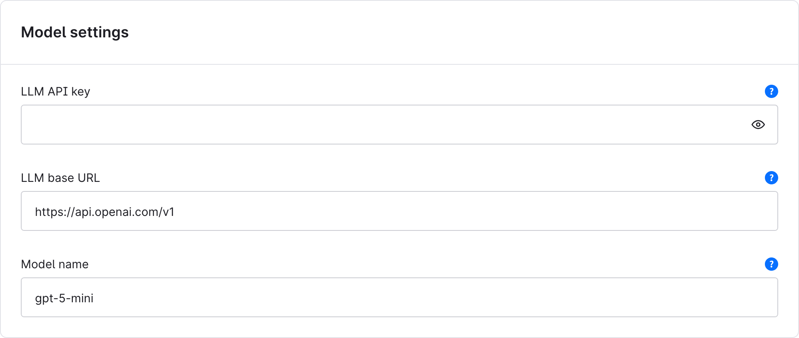
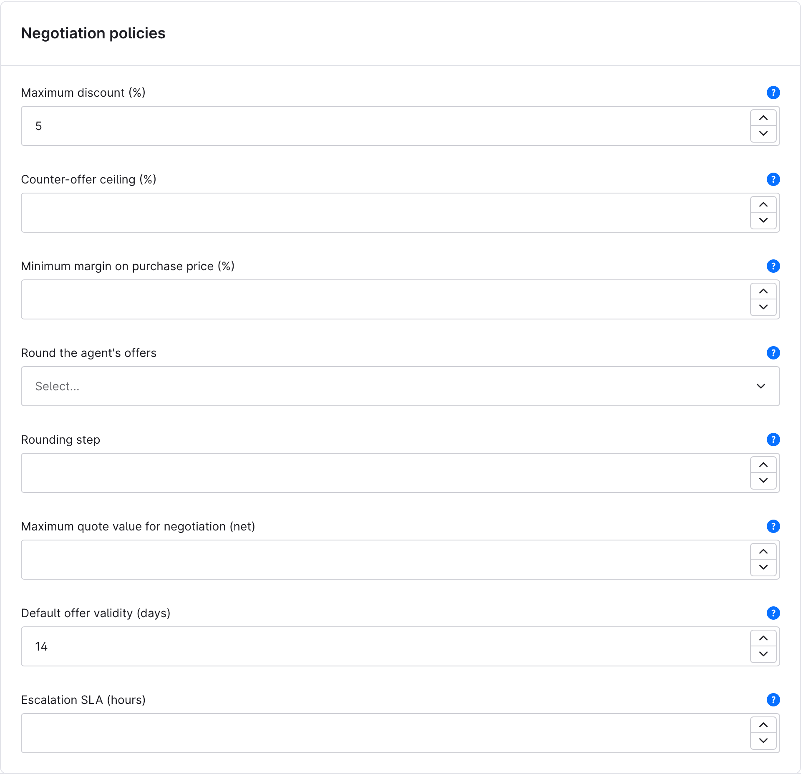
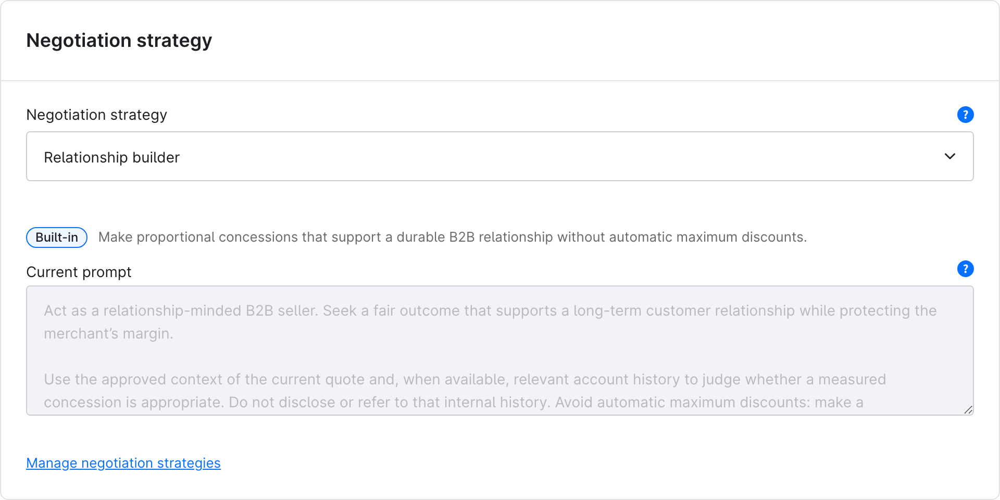
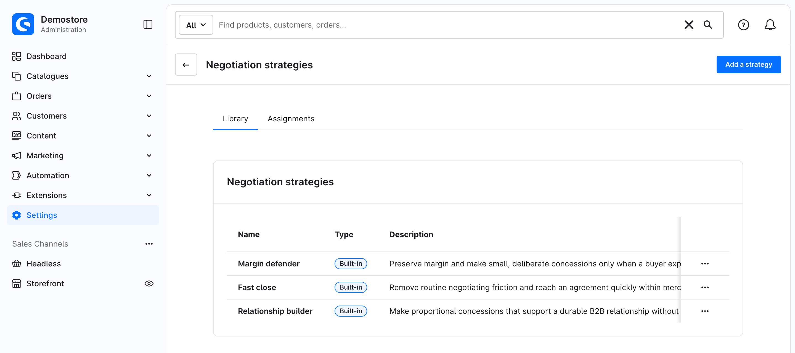
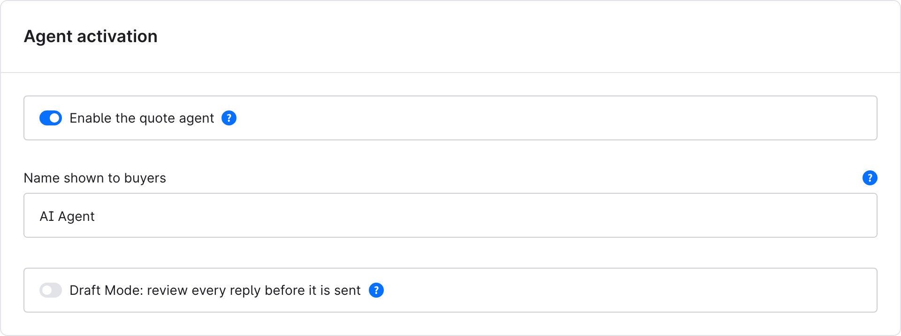
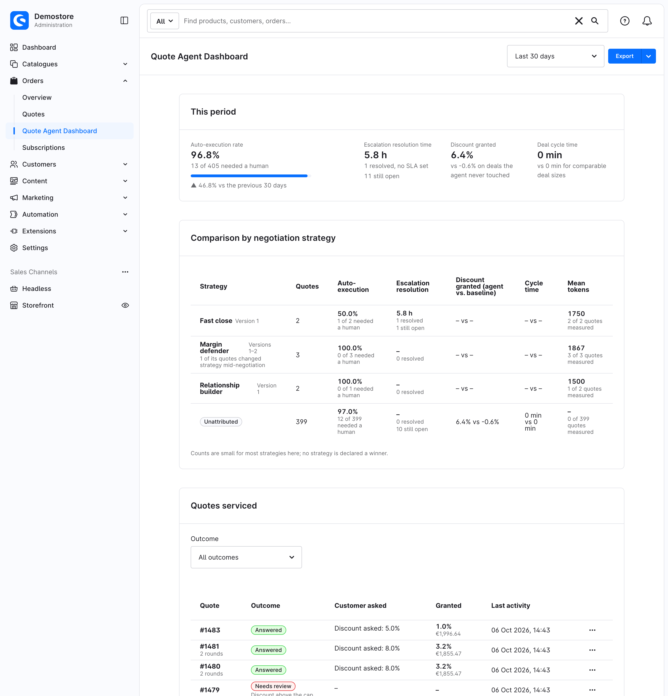
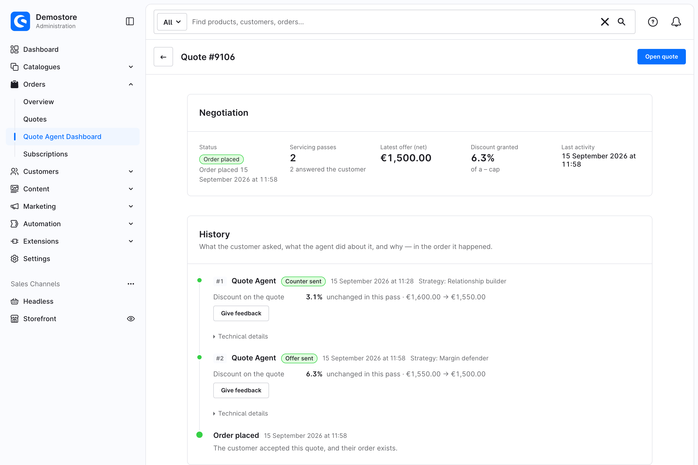

# The Quote Agent, for merchants

A plain-language guide for the person who runs the shop and the deal desk. No
code. If you are implementing or extending the plugin, read
[`end-to-end.md`](end-to-end.md) instead.

---

## In one minute

When a B2B customer asks for a better price on a quote, this plugin answers for
you — but only inside limits you set.

You tell it the most discount it may ever give. It reads what the customer
asked, decides whether that is inside your limits, picks a number, updates the
quote, writes the customer a reply, and logs everything. If the ask is outside
your limits, or is about anything other than price, it does not improvise: it
tells the customer a colleague will follow up, and puts the quote in front of
you.

**It cannot exceed your cap.** The cap is enforced by ordinary code after the AI
proposes a number, and again after the quote is saved. An AI suggestion above
your limit is thrown away and the quote goes to a person.

**It starts switched off, and does nothing until you configure it.** Out of the
box the maximum discount is 0%, which means every price request goes to a human.
That is deliberate: a silent agent is far more often "not set up yet" than
"broken".

---

## What you need before you start

A B2B shop usually has most of this already. Installing the plugin may need
your developer, once. One item is optional and most shops will not want it yet.

| You need | Notes |
| --- | --- |
| Shopware 6.7.1 or newer | Any newer 6.7 release is fine. |
| The B2B quote feature, licensed | This is SwagCommercial with quote management active. The agent works on the quotes that feature creates. |
| An AI provider account and key | **Yours, not ours.** See [Costs and data](#costs-and-data) below. |
| Background workers | Most production shops already run them: Shopware uses `messenger:consume` workers for mails, indexing and other background jobs, and the agent does its work there too. The *admin worker* alone is not enough, because it only runs while someone has the Administration open. |
| The plugin installed | `MerchantQuoteAgentPlugin.zip` is on the [latest release](https://github.com/agentic-commerce-lab/merchant-quote-agent-plugin/releases/latest). You can upload it in the Administration yourself if your hosting allows it. If your shop is deployed by an agency or from a code repository, ask your developer to add it there instead, or the next deployment removes it. |
| *Optional:* the Agentic Commerce extension, 1.3 or newer | Only if you want your customers' own AI assistants to request and negotiate quotes on their behalf. See below. Version 1.2 cannot run alongside this plugin. |

### Do you need the Agentic Commerce extension?

Probably not, to start with. Without it, everything in this guide still works:
your customers request quotes the normal way in the shop, and the agent answers
them with the same policy, the same replies, the same escalations and the same
dashboard.

What it adds is the other direction — letting a *customer's* AI assistant talk
to your shop directly: request a quote, counter it, accept it, without a person
opening your storefront. If that is not a conversation you are having with
customers yet, leave it out. You can add it later, and nothing you have
configured changes.

Turning it on also enables a signed record of each negotiation, for customers
who need one for their own audit trail. That only does anything if the customer
negotiates through an assistant, so it comes and goes with the extension.

---

## Setting it up

Everything is in **Extensions → My extensions → Quote Agent → Configure**, and every
setting is per sales channel. A sales channel uses your global value until you
override it, so you can set a cautious policy everywhere and be more generous
on one channel first. That is the recommended way to start.

### 1. Give it model access

Under **Model settings**:

- **LLM API key** — your own key from your AI provider. Your developer can put
  it in the shop's environment instead, so it never reaches the database: see
  [Keeping the key out of the database](#keeping-the-key-out-of-the-database).
- **LLM base URL** — leave it as it is for OpenAI, or point it at another
  provider from the table below.
- **Model name** — required, with no default on purpose. Naming a default would
  be us choosing your cost and quality for you.



If the key or the model name is missing, the agent does not quietly fall back to
anything. It hands the quote to a person and records that the configuration is
wrong.

#### Which AI providers work

Any provider that offers OpenAI's *Chat Completions* API **with structured
outputs**, which means the model's answer is bound to a fixed format. The agent
needs that to read the answer reliably.

| Provider | LLM base URL | Model name | Good to know |
| --- | --- | --- | --- |
| OpenAI | `https://api.openai.com/v1` (the default) | e.g. `gpt-5-mini` | |
| OpenRouter | `https://openrouter.ai/api/v1` | e.g. `openai/gpt-5-mini` | One key for models from many vendors. This is the way to use Claude or Gemini. Pick a model OpenRouter marks as supporting structured outputs. |
| Azure OpenAI | `https://<your-resource>.openai.azure.com/openai/v1` | your **deployment** name | Use this `/openai/v1` address. The older addresses with `/deployments/` and `?api-version=` in them do not work. |
| Your own gateway, e.g. LiteLLM | the gateway's address, usually ending in `/v1` | whatever the gateway routes | The gateway must pass structured outputs through to the model. |
| A model you host: vLLM, or Ollama 0.5 or newer | e.g. `http://your-server:11434/v1` for Ollama | the model you serve | These servers need no key, but the field cannot be empty: type any placeholder. |

**Not directly:** Anthropic's and Google's own OpenAI-compatible addresses
ignore the required answer format or don't reliably enforce it. Use Claude and
Gemini through OpenRouter or your own gateway instead.

A provider that can't do structured outputs costs you nothing but time: the
agent can't read its answers, so every quote goes to a person and the dashboard
shows *Model unavailable*. If you see that on every quote right after setup,
check the provider and model first.

### 2. Set the limits

Under **Negotiation policies** — this is the important screen:

- **Maximum discount (%)** — the most the agent may ever grant. `0` means every
  price request goes to a human. Start low.
- **Counter-offer ceiling (%)** — optional. If a customer asks for more than your
  maximum but no more than this, the agent counters at *your maximum* instead of
  escalating. Leave it blank and anything above the maximum goes to a person.
- **Minimum margin on purchase price (%)** — optional. The agent never prices a
  product below its purchase price plus this markup: with a purchase price of
  100 and `10` here, 110 is the lowest it may offer. It lowers an offer to that
  floor instead of escalating. Products without a purchase price have no floor.
  Blank means off; `0` means never below cost.
- **Maximum quote value for negotiation (net)** — optional. Above this value the
  agent always escalates, however small the discount. It is one number,
  compared against the quote's net total in whatever currency the quote is in,
  so set it in the currency you actually sell in. If you sell in several, your
  developer can set a ceiling per currency instead; then a quote in a currency
  left out escalates rather than passing, because an unknown limit is not an
  unlimited one.
- **Round the agent's offers** and **Rounding step** — optional, off by
  default. Left alone, the agent's figures can read like machine output: a
  total of 12,356.12 € or 4.34 % off. Pick how they come out round:
  - *Round the discount percentage down*: the step is in percentage points.
    With `0.5`, 7.34 % becomes 7.0 %. Only a quote-wide percentage is
    rounded; an offer the agent makes as per-line prices goes out unrounded.
  - *Round the quote total up*: the step is in your currency, on the total the
    customer sees (gross on a gross quote, shipping included). With `10`,
    12,356.12 € becomes 12,360.00 €. The agent writes this as a fixed-amount
    quote discount, so the quote shows "Discount 103.45 €" rather than a
    percentage.

  The percentage stated in the agent's reply is measured on the whole quote
  total, shipping included. So with *Round the discount percentage down* on a
  quote with shipping, the reply can read 6.97 % while the quote's discount
  line shows 7 %. *Round the quote total up* makes the total the round figure,
  and the stated percentage then follows from it.

  Rounding only ever gives *less* discount, so it can never break your
  maximum, counter band, margin floor or value ceiling. It never rounds a
  figure the customer asked for themselves (their percentage, their line
  prices or their budget). It never takes back a discount they already hold,
  and it never rounds a discount away to nothing. In each of those cases the
  offer goes out unrounded. A blank or `0` step means off, whichever option
  you picked.
- **Default offer validity (days)** — how long the offers it sends stay valid,
  14 by default.
- **Escalation SLA (hours)** — optional, and it changes nothing the agent does.
  It only lets the dashboard tell you how many escalations your team answered in
  time.



### 3. Optionally, set the tone

Under **Negotiation strategy** you pick a strategy from a list instead of
writing one. Three come with the plugin:

- **Margin defender** — preserves margin and makes small, deliberate
  concessions only when a customer explicitly asks.
- **Fast close** — removes routine negotiating friction and reaches an
  agreement quickly, within your limits.
- **Relationship builder** — makes proportional concessions that support a
  durable B2B relationship, without jumping straight to the maximum discount.



You select one per sales channel, and the field shows its current wording
read-only. Editing a strategy's wording takes effect on every sales channel
using it. To adapt one to your own words, use
**Duplicate & edit** on the library page (Settings → Negotiation strategies,
linked below the selector): it copies the chosen strategy into a new one you
can rename and edit freely. The library also lets you create a strategy from
scratch, rename or archive your own (a sales channel still set to an archived
strategy escalates every quote until you choose another), and see which version of a strategy's
wording was actually sent on any past quote — editing never overwrites a past
version, so that history stays intact. The three built-in strategies
themselves cannot be edited or archived from this screen, only duplicated —
we reserve the ability to append a new version to a built-in's own lineage
for a future release.



The library's **Assignments** tab can give some customers a different strategy
from their sales channel's. A **pinned customer** always gets the strategy
pinned to them; otherwise the highest-priority matching **rule** decides;
otherwise a **weighted split** places each customer in one arm and keeps them
there, which is how you A/B-test two strategies. Only when none of these
applies does the sales channel's own selection count.

A strategy shapes *how* the agent negotiates and how the reply is worded —
its tone and posture. **It can never move a cap.** Whatever a strategy's
wording asks for, the policies you set above it are the guardrail: if a
strategy's prompt asked for more than your policy allows, the policy wins and
the quote goes to a person.

### 4. Turn it on

Under **Agent activation**, tick **Enable the quote agent**. While it is off the
agent is completely silent: it answers nothing and writes nothing.
**Name shown to buyers** (default "AI Agent") is what the customer sees above
the agent's messages in their quote conversation.



---

## Draft Mode: approve each reply yourself

Turn on **Draft Mode: review every reply before it is sent** under **Agent
activation** for any sales channel where you want the agent to prepare work
without contacting the buyer. It is off by default. The agent still checks
your limits and prepares an offer, counter-offer, clarifying question or
acknowledgement of the buyer's message or request, but keeps proposed prices
in a private working copy of the quote. Neither the
price nor the reply reaches the buyer until a person sends it. In this mode it
also sends no automatic escalation notice to the buyer.
If you enabled the seeded escalation mail flow in Flow Builder, it can still
mail your team when a draft is ready (`draft_ready`); adjust that flow if you
want a different notification for drafts.

Open **Orders → Quote Agent Dashboard**, choose the **Draft awaiting review** filter,
then open a quote. The review card compares the live quote with the draft.
You can change its price or discount, validity date and reply. **Update
preview** recalculates the proposed totals and offers a reworded reply without
replacing any text you typed. A warning appears if your discount exceeds the
agent's configured cap; a person may still choose to send it. Preview rejects
a price change that would raise the quote above its current live total, and
an unsuccessful preview or Send saves none of its price edits. If the agent
cannot reword the reply, check the existing text yourself before sending.

**Send to buyer** applies the reviewed prices to the live quote, posts your
reply with *you* as its author, and moves the quote to replied. Your usual
Flow Builder mail can then run. **Reject draft** discards the private working
copy without changing the live prices; finish that quote in SwagCommercial.
The agent asks for feedback after rejection and offers it after you edit a
draft before sending. You can also use **Give feedback** on any pass in the
history. The decision export includes reason codes and totals actually sent.
The feedback comment and the sent reply are free text: the dashboard's
**Export** includes them unless you choose **Export without comments or
prompts**, and the command-line export includes them only with
`--include-comments` (see [Costs and data](#costs-and-data)).

Sending is blocked if the buyer wrote again, changed a requested price, or
the quote's state changed after the draft was prepared. It is also blocked if
someone changed the live quote's line prices, quantities, discount, totals or
validity in SwagCommercial. This protects those edits from being overwritten
by the draft on older supported Shopware versions. Reject a stale draft; a new
buyer message starts a new pass. Anyone with the Quote agent viewer role can
see a draft, but only a user granted the additional **Quote agent: review
drafts** permission may preview, send, reject or save feedback. That
permission reaches further than its name: sending a draft reprices the quote,
posts the reply and moves the quote to replied on the reviewer's behalf, even
if their role has no SwagCommercial permission to edit quotes or write quote
comments. Grant it only to people you would let answer the buyer. Switching Draft
Mode off leaves existing drafts reviewable; new passes answer on their own again.
If Send reports an error, check the quote before retrying: its reply may
already be visible to the buyer. When the system detects that situation, it
blocks further review actions until the quote is checked and reconciled.

If you use the Agentic Commerce extension, a sales channel in Draft Mode
advertises 0% automatic-grant authority in its signed A2CN mandate. Buyers'
assistants may have cached an older mandate until its expiry, so do not treat
their cached copy as proof that an offer will be sent automatically.

---

## How a negotiation actually runs

The agent wakes up when a customer submits a quote request, asks for changes on
one, or leaves a comment on one. Then, for that one quote:

1. **It reads the quote and the customer's message.** If nothing has changed
   since its own last reply, it stops here and costs you nothing. A new request
   that comes with no message and no requested price is answered here too: the
   agent sends the quote back at your prices, with its total and how long it
   is valid, so the customer can accept it or ask for a better price. That
   costs no AI call either.
2. **It works out what was asked.** A percentage off, a target price on
   particular lines, a request for your best price, a delivery or payment
   request, or a question.
3. **It checks that against your limits.** This step is ordinary code, not AI.
   If the ask is outside your caps, it escalates *here* — before spending money
   on the expensive part, and it escalates even if your AI provider is down.
4. **It decides the number.** Inside your band, the AI chooses what to offer. It
   does not have to give the maximum, and usually should not. It answers at the
   level the customer asked at: per line if they named line prices, or across the
   quote if they asked for a percentage.
5. **It updates the quote, then checks its own work.** After saving, it re-reads
   the quote from the database and compares it against what was authorised. If
   the two disagree, the quote goes to a person with a note about what the
   database actually says.
6. **It writes the reply.** The facts — the reduction, the new total, the validity
   date — are fixed before the AI words them. If the wording changes any number,
   the plain version is sent instead. The customer then sees a normal quote
   offer.

Repeat visits are handled: it can see its own earlier offers on a quote and keeps
negotiating within the same caps, which are always measured against the *original*
prices, so concessions never quietly compound.

If someone on your team answers a quote by hand — a reply, a note, moving it
along yourself — the agent leaves that quote alone. There is nothing to switch
off and nothing to reset: it simply notices a colleague got there first, and it
starts negotiating again only once the customer comes back with something new.

### It may look at the customer's history

While deciding, the agent can ask for that customer's own past quotes, their
order totals, or what they previously paid for a product on this quote. It uses
this only to choose where inside your band to land.

Two guarantees: **history never raises your cap**, and the agent is instructed
never to quote it back to the customer or confirm what it knows. If a customer
asks what you have on file, it says a colleague can go through their records with
them. History is always limited to that customer's own account.

---

## What always goes to a person

This is the part worth knowing before you promise anything internally. The agent
deliberately refuses to answer these itself:

| The customer asks for | What happens |
| --- | --- |
| A discount above your cap (and above the counter ceiling) | Escalated |
| Anything on a quote above your value ceiling | Escalated |
| Free shipping, express delivery, payment terms, deposits | Escalated. The quote cannot even record these, so answering the price half and dropping the rest would be worse than saying a person will take it. |
| Adding, removing, or re-quantifying products | Escalated. Changing *what* is being sold is outside a price mandate. |
| Volume or bulk pricing with no specific price named | **Not escalated.** It is read as a request for your best price and answered inside your limits. |
| To speak to a human | Escalated |
| Something ambiguous | **Not escalated the first time.** The agent asks the customer a short clarifying question, in their language, and waits. If the answer is still unclear, then a person takes it. |
| A second round of *per-line* price cuts | **Not escalated.** Every round is measured against the original prices, so the cuts across all rounds together stay within your cap. |

And if anything goes wrong — the AI is unreachable, it proposes something outside
your rules, or the saved quote does not match what was approved — the quote goes
to a person. There is no mode where it guesses.

When it escalates, the customer sees one neutral message, unless you untick
**Notify buyer when escalated to a human** under **Escalation**:

> A member of our team will review this quote personally and get back to you.

Your team finds out two ways: a notification in the administration, and a Flow
Builder trigger you can wire to email, Slack, a task, or a tag — whatever your
team already uses. Nothing is emailed by default, because that would mean us
choosing one channel and one recipient for every shop. A ready-made flow,
*Quote agent: escalation needs a human*, comes with its mail template but
switched off: review the template, then activate the flow in Flow Builder.

---

## What you get

### The dashboard

**Orders → Quote Agent Dashboard.** It opens filtered to **Needs review**, so
the first thing you see is the queue that wants a human. Pick a period — last 7,
30, or 90 days — and four figures sit at the top.



- **Auto-execution rate** — how much of the work it handled without you, with
  "*n* of *m* needed a human" beside it and a trend against the previous period.
  Only quotes it actually worked on count: one where it never had anything new
  to answer, or found you already on the quote, is not in *m*.
- **Escalation resolution time** — how long your team takes to answer an
  escalation. Set the SLA field and it becomes "*n* of *m* within the SLA".
- **Discount granted** — what the agent gave, next to what was given on
  comparable deals it never touched, matched to similar deal sizes.
- **Deal cycle time** — how long from request to order, agent versus comparable
  deals.

Below them, **Comparison by negotiation strategy** shows the same measures for
each strategy, plus the average tokens a negotiation used.

Two honest notes. **"Discount granted" is not margin.** It compares the original
price against the price sold; the dashboard does not read your purchase
prices, so it shows no margin figure. And **a figure with
nothing to measure says so** — "Unavailable", "no comparable deals in this
period", "*n* still open" — rather than showing a confident zero. If a tile says
it needs permission to read quotes or orders, that is a role setting, not a bug.

### A record of every quote

The list shows each quote it touched: what the customer asked, what was granted,
and where the quote stands now — *Needs review*, *Draft awaiting review*,
*Answered*, *Question asked*, *Order placed*, *Closed, no deal*, or *No action
needed*. It opens on *Needs review* only; choose **All outcomes** in the
**Outcome** filter to see every quote the agent handled.



Open one and you get the whole negotiation in order: what the customer asked,
what the agent did (*Offer sent*, *Counter sent*, *Question asked*,
*Acknowledged*, *Needs review*, *Left to you* or *No action needed*), what
changed on the quote, and why. Including the exact reply
that was sent, and, when it escalated, the reason in plain words — *Discount
above the cap*, *Quote value above the ceiling*, *Needs human review*,
*Agent not configured*, *Model unavailable*, and so on.

This record is written by the plugin and cannot be edited afterwards, including
by your own staff through the API. It can be deleted by someone you give the
delete role to.

### Who can see what

Three roles, under **Permissions → merchant_quote_agent**:

- **viewer** — read the dashboard, the records and the strategy library. It
  brings read access to quotes, orders and customer records with it, which the
  tiles and the strategy assignments need.
- **deleter** — additionally remove audit rows.
- **editor** — additionally create, duplicate, rename and archive strategies,
  and change their assignments.

The additional **Quote agent: review drafts** permission (see
[Draft Mode](#draft-mode-approve-each-reply-yourself)) lets its holder send a
draft, which changes the quote and answers the buyer without SwagCommercial's
own quote permissions.

There is also an **Agent access** page under Settings, but only if you run the
Agentic Commerce extension — it controls which customer assistants may talk to
your shop, and it edits that extension's own data, so it is gated by that
extension's permissions rather than the two above. Without the extension the
page is not in Settings at all.

---

## Costs and data

**You pay for the AI, directly.** The key is yours, so there is no per-quote fee
from us and no markup. Budget roughly three AI calls per customer message:
one to read the request, one to decide, one to word the reply, and up to two
more when it looks up the customer's history. A repeat trigger
with nothing new on the quote makes none. An ask that is outside your caps makes
one, not three.

**What is sent to your AI provider.** To do its job the agent sends that
provider the quote's line items with quantities and prices, the customer's
message, and its own earlier replies. If it looks at history, that adds figures
about the account — how many past quotes, how many became orders, lifetime order
value, past prices for a product on this quote.

It never sends fields from the customer's profile: no name, no company name, no
address, no contact details, no payment data. Comment authors are handled as
internal IDs, which are not sent either. The one thing outside your control is
the message itself — whatever the customer typed is sent as they wrote it, so if
they sign it or include a phone number, that text goes with it.

Choose your provider and base URL accordingly. That setting exists so you can
point at a European endpoint, your own gateway, or a model you host yourself, if
that is what your privacy commitments require.

**Everything else stays in your shop.** Quotes, prices, the audit record and the
API key all live in your own Shopware installation. Nothing goes to us unless you
send it yourself, which is the next part.

**If you want to share your logs with us.** Two ways to prepare data to leave
your shop, and both only run when you ask for them.

On the agent's dashboard, **Export** downloads the period the date selector at
the top is showing. That is the easier one, and it is the one to use if you do
not work in a shell.

The command does the same thing for any range you name:

```
bin/console merchant-quote-agent:export --from=2026-09-01 --to=2026-10-01 > september.jsonl
```

Either way you get one line of JSON for every decision the agent recorded in that
range, each carrying the step-by-step trace of how the agent got there. Separate
event lines follow for attempts that stopped before a decision, such as a paused
agent, a busy quote or an unavailable gateway. Each event says why it stopped.
`--from` is included, `--to` is not, so the line above is exactly September.
Nothing schedules either of them, nothing calls them, and neither sends anything
anywhere: you get a file, and what you do with that file is your decision. We
ask for it because negotiation strategies get better when they can be measured
across more than one shop.

Four lists, and together they are the whole boundary.

*Leaves, as a scrambled code.* The record or event itself, the quote, the customer, the
sales channel, the quote revision and the strategy version. Each is replaced by a
code computed from a secret unique to your shop. The same customer is the same
code in every export you make, so repeat-buyer patterns are still visible, and a
different code from every other shop's, so nobody can line your customers up
against anyone else's — or against your own database. One exception: with the
comments included, the model's prompts can carry the quote number, so an export
with comments can be matched to your own records. The secret is created the
first time you export and kept in your shop's configuration. If you delete it,
future exports stop lining up with past ones, which is also how you sever that
link on purpose.

*Leaves, as it is.*

- When the agent acted, what triggered it, and when the quote was last changed.
- What the customer asked for, as the agent understood it: prices, quantities,
  delivery and payment terms.
- What your rules allowed, the currency, the totals before and after (net, and
  gross as the customer saw it), and the discount granted. Each verdict also
  carries a short code for the limits it was decided under: the same code means
  the same settings, and the settings themselves do not leave.
- What the agent decided and why, whether its offer passed the checks, and which
  changes it made to the quote.
- Which prompt version ran, the model name and the host it was called on, token
  counts and timings.
- **For every step of every decision:** which call it was, the model that
  answered, token counts, timings, retries and whether it failed; the policy's
  verdict and its figures; whether a reworded reply was rejected; and how many
  lines the quote had before and after.
- The type of any error and where in the code it happened — not its message.
- How the quote ended and when, and when someone on your team resolved an
  escalation and how.
- In Draft Mode, how each draft was reviewed:
  - `reviewStatus` — `pending`, `sent`, `rejected` or `superseded`; empty unless
    the pass produced a draft.
  - `reviewedAt` — when you sent or rejected the draft.
  - `sentChanges` — the totals you actually sent, and whether you edited the
    agent's draft first.
  - `feedbackReasons` — the reason codes you picked.
  - `feedbackAt` — when you left that feedback.
- **If the agent looked up the customer's history, a summary of the account**: how
  many past quotes, how many became orders or were lost, offers made and accepted,
  the last discount granted, the number of orders, **lifetime order value**, and
  the date of the last order — plus which kind of lookup it made. This is the most
  commercially sensitive thing that leaves by default. It is tied to the scrambled
  customer code rather than to a name, but it does describe that customer's
  relationship with you.

*Does not leave, ever.* Names, e-mail addresses, postal addresses, phone numbers
and company names — the agent's record does not hold them to begin with.
A draft's internal bookkeeping also stays in the shop: `draftVersionId`, the
working copy of the quote it was prepared in, and `reviewFingerprint`, which
records buyer input and live pricing at draft time.

*Leaves only with the comments.* The quote number and the details behind a
history lookup — which past quotes and orders the agent read, their numbers,
products and prices, and which product it asked about — never leave in their
own fields. But the model's full prompts do contain them, because that is what
the model was shown, and the full prompts are part of the comments below.

**The comments are the part to decide about, and the two ways round differ.** The
customer's own message, the agent's replies, the model's full prompts and raw
answers, snapshots of the quote, the reasons it gave for escalating, the
questions it raised and the full text of any error messages are the most useful
part of the data and the most sensitive. In Draft Mode they also include the
reply you actually sent (`sentReply`) and the feedback you wrote about the
agent's draft (`feedbackComment`) — either can quote the customer. The
customer's message is stored word for word, and anything they typed — a
signature, a phone number, an order reference — is in it, and can come back a
second time in the model's own words.

The agent keeps that message so that a decision can be explained afterwards:
when it reads a comment and concludes there was nothing to answer, the record of
what it read is the only way to check that it was right. Nothing shows it to
anyone outside your shop unless you export it.

**The trace is kept, and nothing cleans it up.** The agent also stores, for
every decision, exactly what it sent to the model and what came
back — about 100 to 150 KB per decision. It stays in your shop, in its own table,
until you uninstall the extension with "remove all data".
`merchant-quote-agent:forget` clears it for one customer along with their
comments.

The dashboard's **Export** includes the comments. To leave them out, use **Export
without comments or prompts** in the menu beside that button.

The command leaves them out, and `--include-comments` puts them in. It prints
which of the two you just produced on every run, so a redirected export is never
ambiguous about what is in the file.

**Reading one kind of decision.** `--outcome` narrows the file to a single kind.
Events that stopped before a decision have no outcome and are omitted from a
filtered file; the run says so on screen. The two worth looking at now and then are

```
bin/console merchant-quote-agent:export --from=2026-09-01 --to=2026-10-01 \
    --outcome=acknowledged --include-comments
```

```
bin/console merchant-quote-agent:export --from=2026-09-01 --to=2026-10-01 \
    --outcome=nothing_to_do --include-comments
```

The first gives you every pass that answered without negotiating: a customer's
message with nothing in it to act on, or a new quote request that came with no
message at all. The agent answered each one by restating the quote and sending
it for acceptance, so the customer is never left waiting — but if one of those
messages was a real question, this is where you find it, and the agent's
reading of comments is what needs adjusting, which is worth telling us about.
`--outcome=nothing_to_do` lists the passes that stayed silent because nothing
was new since the agent's last answer. A quote escalated to your team is not
among them: while it waits for you, the agent stands down and records
`handed_over`. Once you have sent an answer, or written one in the quote's
conversation while it shows *Replied*, the customer's "thanks" is acknowledged
like any other.

**One oddity you will see and should not report as a bug.** The `modelHost`
field sometimes reads `unparsable-host`. That means the AI base URL in your
settings was not a URL the shop could read a hostname out of — usually a typo.
The agent records that placeholder rather than the address you typed, because a
base URL can carry your API key in it and that must never reach a log or an
export.

### Keeping the key out of the database

The API key you type into the settings is stored in your shop's configuration.
The field hides it on screen, but it is not encrypted at rest — the same as
every other secret a Shopware extension holds. Treat database access
accordingly.

Better: have your developer put the key in the shop's environment, for example
in the `.env.local` file in the shop's root folder:

```dotenv
MQA_LLM_API_KEY=your-key-here
```

The agent then uses that key on every sales channel and ignores the field. The
key never reaches the database, so neither a database dump nor an admin API
token with `system_config:read` can reveal it. The shop's PHP processes and
background workers read the environment only when they start, so restart them
after setting it. The base URL and model name can come from the environment
too: [Configuration from the environment](end-to-end.md#configuration-from-the-environment)
shows how.

---

## Day to day

**Your routine is the Needs review queue.** Open the dashboard, work the
escalations, and the agent handles the rest. When you answer an escalated quote —
by sending a revised offer, replying to the customer in the quote's
conversation, or however you normally close it — the plugin notices and stops
counting it as open. The agent stays out of an escalated quote until you send
it. If the quote was already sent and shows *Replied*, any message you write
in its conversation counts as that answer — even an interim note like "we are
looking into it" — and the agent answers the customer's next message itself,
even if the customer then requests changes. If you want to keep the agent out
of it, do not comment on a *Replied* quote until your answer is ready; send it
instead. While the quote is in any other state, a comment is not that answer:
the quote stays in *Needs review*, and the agent stays silent on it, until you
send it.

**Raising the cap.** Start with a low maximum on one sales channel, watch the
auto-execution rate and the discount figure for a couple of weeks, then widen.
Changes take effect on the next customer message; nothing is retroactive.

**If the agent seems to do nothing**, check these in order:

1. Is the dashboard list still on its default filter? It shows *Needs review*
   only, so an empty list means nothing is waiting for you. Choose **All
   outcomes** to see what the agent answered.
2. Is **Enable the quote agent** ticked for *that* sales channel?
3. Is **Maximum discount** still `0`? Then everything escalating is correct
   behaviour.
4. Is **Draft Mode** on? Then every reply waits for you under the **Draft
   awaiting review** filter.
5. Are the background workers running? Most shops have them. If requests pile
   up and nothing happens, even while you have the Administration open, ask
   your host to check `messenger:consume`.
6. Does the customer have the B2B quote feature enabled on their account? Without
   it they cannot have a quote at all.

**If a customer gets two replies to one message**, tell your developer the admin
worker and the background worker are both running. It is a known configuration
clash with a known fix, and it does not double the discount — offers are written
as final values, not added on top of each other.

---

## Limits worth knowing

Stated plainly, so nothing here is a surprise later:

- It negotiates **price and offer validity**. Nothing else.
- **Rounding** (either mode) works on quote-wide offers only. A per-line
  offer (mostly the customer's own line prices) goes out unrounded, so its
  quote-wide percentage can read as, say, 3.73 %. Quote-total rounding is also
  skipped on a quote that adds tax on top of net prices: the tax is rounded
  per rate after the discount, so no fixed amount is guaranteed to land on a
  round total. (Rounding the discount percentage still works there.) A gross
  quote whose goods are all at 0 % VAT but whose shipping is taxed looks the
  same from the agent's side and is treated the same way, conservatively: the
  offer goes out unrounded. Shopware's own cash rounding is unaffected as long
  as your step is a multiple of its interval.
- There is **no rules-only mode**. Reading a customer's free-text request needs
  the AI, so an agent without model access does not negotiate more
  conservatively — it escalates.
- **Invalid settings take the channel out of service** rather than applying half
  a policy. A cap above 100, for instance, escalates everything and logs why.
- It **never places an order** and never touches a quote that is already
  accepted, declined, expired or cancelled.
- The customer's own words **are** stored in the audit record, alongside what the
  agent understood them to be asking for — so a decision can still be explained
  when the agent read a message and concluded there was nothing to answer. They
  stay in your shop unless you export them with `--include-comments`, and the
  whole record is deleted if you uninstall the extension without keeping its
  data.

---

## Where to go next

- Your developer's reference: [`end-to-end.md`](end-to-end.md)
- Why the extension is built the way it is:
  [`adr/0001-runtime-plugin-dependencies.md`](adr/0001-runtime-plugin-dependencies.md)
